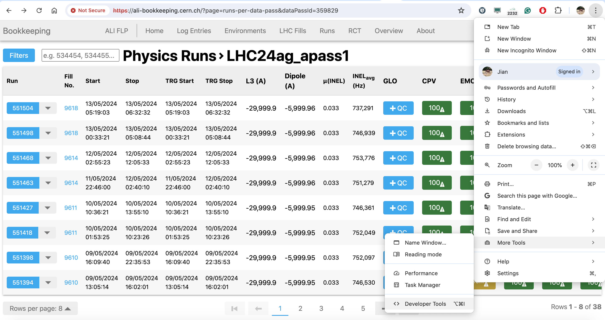
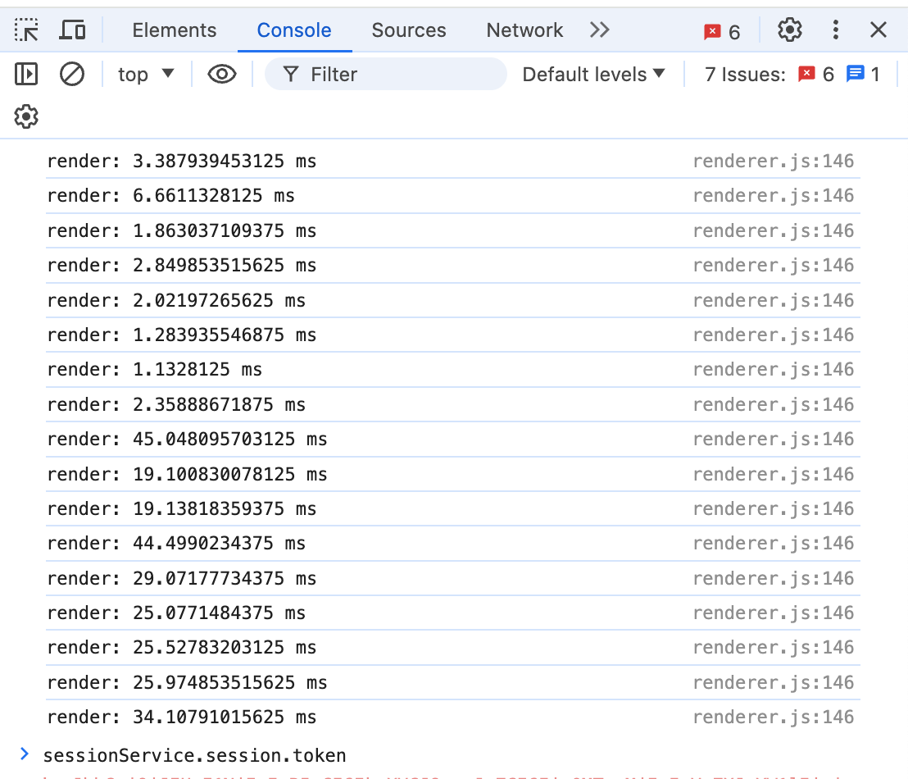

## Produce a run list from the Temporary RCT (Google spreadsheets)
- The configuration file
  - sheet_name: the name of the google spreadsheets, e.g., `QC_summary_data_2023_pbpb` for 2023 Pb-Pb.
  - tab_name: the name of the tab that you want to take.
  - periods: add which period(s) you want to include in the runlist; if empty, takes all periods in the tab.
  - runlists name: the dumped file name. detectors: add the requested detectors and the flags.
  - pass_shift: select which apass to be checked. For example, "1" refers to the first apass for a detector.
  - pass_name: set the apass name which will be in the dumped file.
  - runlists -> name: indicating which run list it is, e.g., CBT, CBT_hadronPID
  - separate_22o_test: set whether to separate LHC22o_test. Default is "False"
- Make sure you have the certificate runlist-5dfcf12a816d.json under the same folder where you run the script. Contact Jian Liu (jian.liu@cern.ch) for the certificate.
- `python3 runlist.py config_pp.json`
- Take `config_pp_2022.json` as the reference configuration file for 2022 periods, config_pp.json or config_pbpb.json for 2023 periods

## Export runs from RCT (in Bookkeeping)
- The configuration file:
  - "token": add your token to access Bookkeeping
  - "dataPassNames": asynchronous pass name(s). Example:
```
    "dataPassNames": {
        "LHC23zzo_apass3": {},
        "LHC24al_cpass0": {
            "run_range": [554413,554538]
        }
    },
```
The range of runs can be set in this configration file by the "run_range" for each period. No filtering on the runs if the "run_range" is null.
- Example file: config_rct.json.  
- `python3 rct.py config_rct.json`
- Separate .csv files are saved for each period if you have more than one period in the configuration file
## Produce run lists from RCT
- Produce the .csv files mentioned in **Export runs from RCT (in Bookkeeping)** 
- Example configuration file: rct_runlist.json. Modify it according to your needs
- `python3 rct_runlist.py rct_runlist.json -d csv_file_path`. The `-d` can be omitted if the .csv files are already in the current directory. Add `--convert-time` if you want to save the timestamps in human-readable format. 
## Calculate and upload mu/INEL rate to RCT
The scritps needed and the example configuration files can be found under `INEL_Mu`. 
- `python3 inel_mu_calculation.py mu_inel.json` 
- `python3 uploading.py upload.json`
## Flagging multi-runs in RCT
Currently, only run-based (covering the whole run duration) flags can be added with this script. Put your Bookkeeping token to the json configuration file. The `flagTypeId` can be found at [QC flag types in Bookkeeping](https://ali-bookkeeping.cern.ch/?page=qc-flag-types-overview). `--max_run`, `--min_run`, `--excluded_runs` and `--comment` are optional. If omitted, all runs from the pass will be flagged. Add your BK token to the configuration json file.
- Example command for unique flag type and comment: 
```
python3 rct_post_flag.py rct_post_flag.json --data_pass "LHC24a_cpass0" --detector "ITS" --flagTypeId 11 --max_run 106 --min_run 53 --excluded_runs 54
```
- Example command for multiple flags and comments in a .csv file. The structure of the .csv file needs to be as the one in test.csv, meaning that you need a column called `post` that indicates the runs that you want to post, a column called `run_number` that contains the list of the runs, and several column with the name of a certain pass (e.g. `LHC24an_apass1_skimmed`) that contains the run quality for that pass, and a colum called `comment` that contains the comment to the run. The quality posted on the RCT correspond to the quality of the run in the pass provided in input using `--data_pass`. Note that you need a .csv file for each period, but per peiod you can have the quality of the different passes. To include a certain run in the run posted write `ok` under the column `post` in the .csv file.
```
python3 rct_post_flag.py rct_post_flag.json --data_pass "LHC24al_cpass0" --detector "ITS" -b test.csv
```
- It is possible to have in output a file that contains the minutes for the aQC meeting, based on the posted runs. To produce it use the argument `--minutes <name_of_the_file.txt>`, if the file is not present it will be generated and filled, otherwise the new info will be added to that file. The flags considered for the minutes at the moment are: `Good`, `Limited Acceptance (MC Reproducible)`, `Limited Acceptance (MC Not Reproducible)`, `Bad Tracking`, `Bad PID`, `Unknown`, and `No Detector Data`. An example of the minutes that can produced with the script is reported in `ex-minutes.txt`. If you are checking runs in a pass that is not `cpass0` you may want to say explicitly that the quality of the run in the new pass is the same as in the previous pass, you can add this info to the minutes by adding the arguent `--no_diff`. At the moment these features are available only when using the script in batch mode. An example of the command to post the flags and obtain the minutes is:
```
python3 rct_post_flag.py rct_post_flag.json --data_pass "LHC24al_cpass0" --detector "ITS" -b test.csv --minutes minutes.txt --no_diff
```
- If the quality of the non-GOOD runs is time-dependent (i.e. it is GOOD until a problem occur and bad/limited acceptance later) you need to post the flag on the RCT by hand. You can use the option `--time_dep` to mark all the non-GOOD runs as time-dependent, in this way they will be considered with this flag in the minutes, but the corresponding flags will not be posted. Of course, the usage of the option `--minutes` is compulsory to use this option.
## Verifying multi-runs in RCT
Both the latest run-based and time-dependent flags for each run can be verified with this script. Put your Bookkeeping token to the json configuration file. The `--comment`, `--max_run`, `--min_run` and `--excluded_runs` are optional. If `--max_run` and `--min_run` are omitted, all runs from the pass will be verified. Add your BK token to the configuration json file. **This script is not well tested. Suggest verifying the time-dependent flags by hand.** 
- Example command:
```
python3 rct_verify_flag.py rct_verify_flag.json --data_pass "LHC22a_apass1" --detector "FT0"  --max_run 106 --min_run 53 --excluded_runs 54 --comment "test"
```
## How to generate a token in BK/RCT
- Login to the BK
- In your browser (below an example in Chrome), 

navigate to the settings (3-dot icon on the left) -> open the `Developer Tools`,

type `sessionService.session.token`, and press Enter to produce the token.

**The token expires in 1 week! One needs to reproduce it regularly.** 

## Macros for the MID
- `merge-csv.py` is used to merge the csv downloaded with `rct.py`. Put all the csv that you want to merge in a folder, anche change the name of `file_name` to the name of the folder. The script will produce 3 files, one with all the runs and the quality of the MID, one with good runs, one with Bad Tracking runs, and one with Limited Acceptance (MC rep) runs.
- `merge-quality.py` it reads the output with the quality of all the runs created with `merge-csv.py` and other txt files that contains the quality of data/MC comparison using different criteria and produces a file with the run number and all the flags. Change the value of `period` and put it as the name of the folder that contains the csv from `merge-csv.py`. The other txt files need to be in a folder called `data-MC-quality` inside the folder with the csv files.
